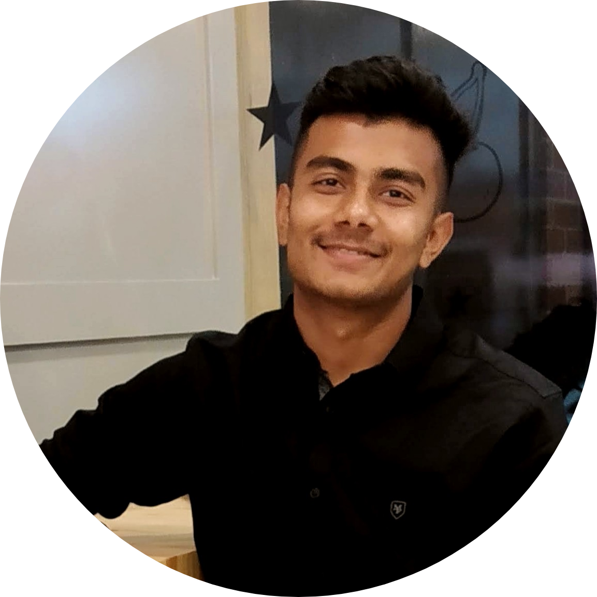
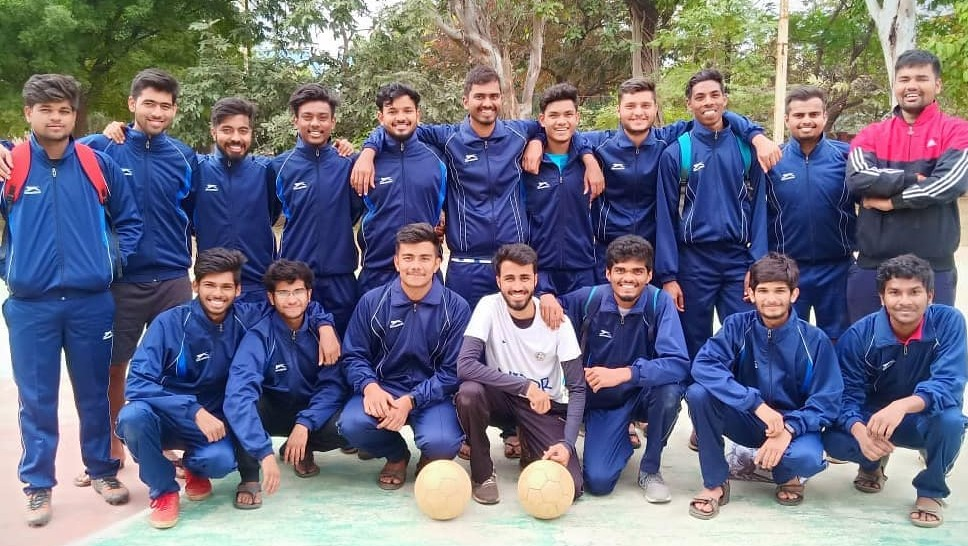

## Hello! This is Pratik Kumar

I am an ECE engineering graduate(Batch of 2020) from India. I am passionate about deep learning and data science. I primarily work in Computer Vision, Machine Learning, Deep Learning, Data Visualizations and Data Science. 

I am fascinated by the abilities of machines to learn and on the same time I am also curious about wonderful capabilities of human brain. Here on this website, I usually write and share my work on deep learning and data science topics. You can also view my blogs on Medium (check [here](https://medium.com/@pratikbaitha04)). Currently I am looking for full time or part time opportunities in data science or deep learning.

I love to play football. During my bachelors, I led my college football team as a captain. 

 My Team - NITRR-FC 💙

 

#### Do you like my work? or Want to contact/connect with me? or Do you want to hire me?

- Please visit my [portfolio website](https://pr2tik1.github.io/) for complete background and contact details. 
- Gmail : pr2tik1@gmail.com 
- LinkedIn: [Profile](https://www.linkedin.com/in/pratik-kumar04/)

This website is powered by **[fastpages](https://github.com/fastai/fastpages)**.